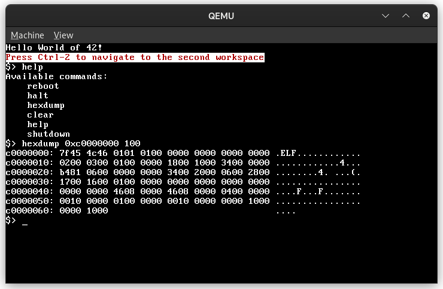

# kfs 'Jellyfish' - 5.0

Our simple Kernel From Scratch made out of asm and rust for i386 - x86.  



## Dependencies
To build the kernel image, the host need `nasm` to compile asm's files and cross-compiling tools + cargo or `docker` to build both linker and cargo (compile rust files).
To boot, the host need `qemu` and `qemu-system-i386` executable.

## Compilation
Docker daemon must be running or you must have installed all the dependencies then run:
```
make
```
The bootable image is named `kfs_$VERSION`.

## Boot
To boot and emulate it we provide a simple Makefile command:
```
make boot
```
That will launch qemu on the `kfs_$VERSION` executable.  
A `kernel.log` file at root will store every output.

## Unit-Testing


